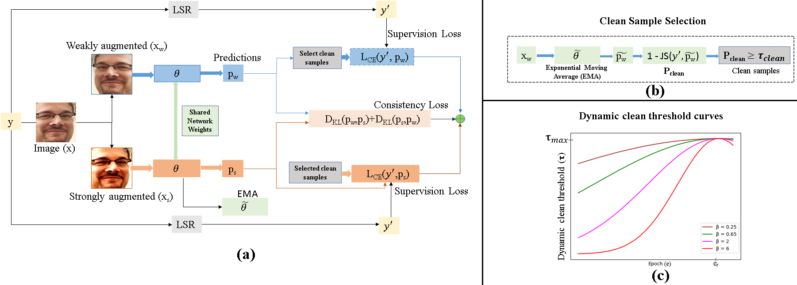

# HandlingAmbigiousFERAnnotations

Title: Handling Ambiguous Annotations for Facial Expression Recognition in the Wild

Authors: Darshan Gera, Vikas G N and Dr. S. Balasubramanian, SSSIHL.

Any queries please mail to: darshangera@sssihl.edu.in.

Acknowledgments: We dedicate this work to Bhagawan Sri Sathya Sai Baba, Divine Founder Chancellor of Sri Sathya Sai Institute of Higher Learning, PrasanthiNilyam, A.P., India.

Cite: Darshan Gera, Vikas G N, and Balasubramanian S. Handling Ambigu-ous Annotations for Facial Expression Recognition in the Wild. In Indian Conference on Computer Vision, Graphics and Image Processing (ICVGIP’21), December 19–22, 2021, Jodhpur, India.
